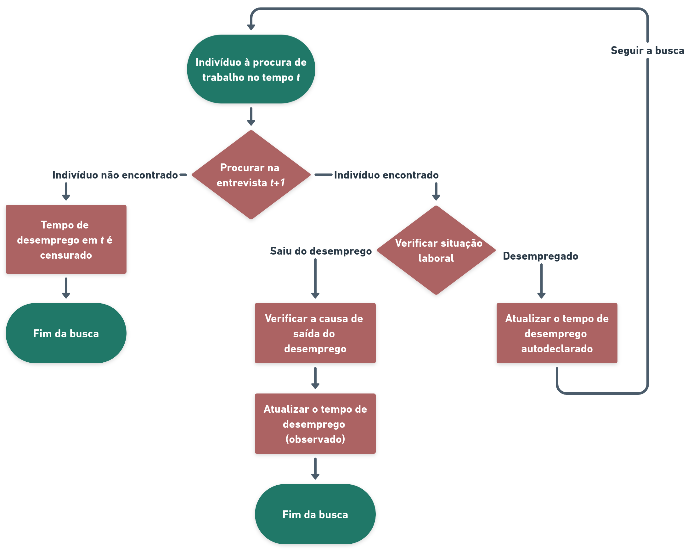

```{r setup, include=FALSE,warning=FALSE,message=FALSE}
knitr::opts_chunk$set(
	echo = FALSE,
	message = FALSE,
	warning = FALSE,
	fig.align = 'center',
	out.width = '80%'
)

```

## Fluxograma da elaboração do banco de dados.

O banco aqui analisado foi construído de acordo com o seguinte esquema, aplicado para cada indivíduo inicialmente em busca de trabalho na entrevista *t*:

```{r pressure, echo=FALSE, out.width = '80%',fig.align='center'}

```

```{r message=FALSE, warning=FALSE}
# Bibliotecas
library(tidyverse)
library(data.table)
library(magrittr)
library(ggsurvfit)
library(readxl)
library(gmodels)
library(epitab)

```


```{r}
### Carrega os dados gerados no script de manipulacao_banco_final
setwd("/home/lauratei/UNB/TCC/Code/tcc-code")
dados <- readRDS(file = "Dados-RDS/dados_sobrevivencia.rds")

```

```{r}
### Carregando dados do IVS

ivs <- readxl::read_xlsx("dados_ivs.xlsx",sheet = "Dados")
ivs$UF <- ivs$`Nome da UF`

dados <- left_join(dados,ivs[,c("UF","IVS","IVS Infraestrutura Urbana",
                                "IVS Capital Humano","IVS Renda e Trabalho")],by="UF")

dados$IVS <- as.numeric(dados$IVS)
dados$`IVS Capital Humano` <- as.numeric(dados$`IVS Capital Humano`)
dados$`IVS Infraestrutura Urbana` <- as.numeric(dados$`IVS Infraestrutura Urbana`)
dados$`IVS Renda e Trabalho` <- as.numeric(dados$`IVS Renda e Trabalho`)

## Indicando as faixas do IVS

dados <- dados %>% mutate(IVS_faixa = 
                            case_when(
                              IVS<0.2 ~ "Muito baixa",
                              IVS>=0.2 & IVS<0.3 ~ "Baixa",
                              IVS>=0.3 & IVS<0.4 ~ "Média",
                              IVS>=0.4 & IVS<0.5 ~ "Alta",
                              IVS>=0.5 ~ "Muito alta"
                            ),
                          IVS_faixa_infra = 
                            case_when(
                              `IVS Infraestrutura Urbana`<0.2 ~ "Muito baixa",
                              `IVS Infraestrutura Urbana`>=0.2 & `IVS Infraestrutura Urbana`<0.3 ~ "Baixa",
                              `IVS Infraestrutura Urbana`>=0.3 & `IVS Infraestrutura Urbana`<0.4 ~ "Média",
                              `IVS Infraestrutura Urbana`>=0.4 & `IVS Infraestrutura Urbana`<0.5 ~ "Alta",
                              `IVS Infraestrutura Urbana`>=0.5 ~ "Muito alta"
                            ),
                          IVS_faixa_humano = 
                            case_when(
                              `IVS Capital Humano`<0.2 ~ "Muito baixa",
                              `IVS Capital Humano`>=0.2 & `IVS Capital Humano`<0.3 ~ "Baixa",
                              `IVS Capital Humano`>=0.3 & `IVS Capital Humano`<0.4 ~ "Média",
                              `IVS Capital Humano`>=0.4 & `IVS Capital Humano`<0.5 ~ "Alta",
                              `IVS Capital Humano`>=0.5 ~ "Muito alta"
                              
                            ),
                          IVS_faixa_trabalho = 
                            case_when(
                              `IVS Renda e Trabalho`<0.2 ~ "Muito baixa",
                              `IVS Renda e Trabalho`>=0.2 & `IVS Renda e Trabalho`<0.3 ~ "Baixa",
                              `IVS Renda e Trabalho`>=0.3 & `IVS Renda e Trabalho`<0.4 ~ "Média",
                              `IVS Renda e Trabalho`>=0.4 & `IVS Renda e Trabalho`<0.5 ~ "Alta",
                              `IVS Renda e Trabalho`>=0.5 ~ "Muito alta"
                              
                            ))

# Transformando as faixas em fator

dados$IVS_faixa <- factor(dados$IVS_faixa, levels=c("Muito baixa","Baixa","Média"))

dados$IVS_faixa_humano <- factor(dados$IVS_faixa_humano, levels=c("Muito baixa","Baixa","Média"))

dados$IVS_faixa_infra <- factor(dados$IVS_faixa_infra, levels=c("Muito baixa","Baixa","Média","Alta"))

dados$IVS_faixa_trabalho <- factor(dados$IVS_faixa_trabalho, levels=c("Muito baixa","Baixa","Média","Alta"))

```


```{r}
### Criando variavel de Regiao

ufs_norte <- c("Acre","Amapá","Amazonas","Pará","Rondônia","Roraima",
               "Tocantins")

ufs_nordeste <- c("Alagoas","Bahia","Ceará","Maranhão","Paraíba",
                  "Pernambuco","Piauí","Rio Grande do Norte",
                  "Sergipe")

ufs_centro_oeste <- c("Distrito Federal","Goiás","Mato Grosso",
                     "Mato Grosso do Sul")

ufs_sudeste <- c("Espírito Santo","Minas Gerais","Rio de Janeiro",
                 "São Paulo")

ufs_sul <- c("Paraná","Rio Grande do Sul","Santa Catarina")

dados <- dados %>% mutate(regiao =
  case_when(
    UF %in% ufs_norte ~ "Norte",
    UF %in% ufs_nordeste ~ "Nordeste",
    UF %in% ufs_centro_oeste ~ "Centro-Oeste",
    UF %in% ufs_sudeste ~ "Sudeste",
    UF %in% ufs_sul ~ "Sul"))

```

```{r}
### Criando variavel de faixa etaria

# histograma das idades
#hist(dados$V2009)
#sum(dados$V2009>=14 & dados$V2009<=20)
#sum(dados$V2009>=21 & dados$V2009<=30)
#sum(dados$V2009>=31 & dados$V2009<=40)
#sum(dados$V2009>=41 & dados$V2009<=50)
#sum(dados$V2009>=51 & dados$V2009<=70)

faixa1 <- 14:20
faixa2 <- 21:30
faixa3 <- 31:40
faixa4 <- 41:50
faixa5 <- 51:70

dados <- dados %>% mutate(faixa_etaria =
  case_when(
    V2009 %in% faixa1 ~ paste(min(faixa1),"a",max(faixa1),"anos"),
    V2009 %in% faixa2 ~ paste(min(faixa2),"a",max(faixa2),"anos"),
    V2009 %in% faixa3 ~ paste(min(faixa3),"a",max(faixa3),"anos"),
    V2009 %in% faixa4 ~ paste(min(faixa4),"a",max(faixa4),"anos"),
    V2009 %in% faixa5 ~ paste(min(faixa5),"a",max(faixa5),"anos")
    )
  )

```

## Paleta de Cores

```{r, out.width = '50%',fig.align='left'}
### Criar tema de todos os gráficos e vetor de cores

tema <- theme_bw() +
theme(axis.title.y=element_text(colour="black", size=12),
axis.title.x = element_text(colour="black", size=12),
axis.text = element_text(colour = "black", size=12),
panel.border = element_blank(),
axis.line = element_line(colour = "darkgray"),
plot.title = element_text(hjust = 0.5, size=14),
legend.text=element_text(size=10))


vetor_cores <- c("#0f4c5c","#e36414","#ffb726","#9a031e","#5f0f40","#0f5f4e")


cores <- data.frame("type"=LETTERS[1:6],"val"=1,"col"=vetor_cores)

ggplot(cores,aes(x=type))+geom_bar(fill=cores$col)+
tema +
  coord_flip()

```


```{r}
### Proporcao de censura

#table(dados$censura_text)
#table(dados$censura_text)/nrow(dados)

prop_censura <- data.frame("Censurado"="55827 (64,89%)",
                           "Observado"="30209 (35,11%)")


knitr::kable(prop_censura, align = "c")

```

```{r}
### Proporcao das causas
dados$causa2 <- dados$causa
dados$causa2[is.na(dados$causa2)]<- "censurado"

#table(dados$causa2)
#table(dados$causa2)/nrow(dados)

prop_censura <- data.frame("Censurado"="55827 (64,89%)",
                           "Emprego informal"="14779 (17,18%)",
                           "Emprego formal"="7981 (9,28%)",
                           "Inatividade"="7449 (8,66%)",check.names = F)


knitr::kable(prop_censura, align = "c")
```


## Tabela geral das frequências das covariáveis

```{r}

dados$all <- factor(".",levels=c("."))
dados$faixa_etaria <- factor(dados$faixa_etaria,levels=c(paste(min(faixa1),"a",max(faixa1),"anos"),paste(min(faixa2),"a",max(faixa2),"anos"),paste(min(faixa3),"a",max(faixa3),"anos"),paste(min(faixa4),"a",max(faixa4),"anos"),paste(min(faixa5),"a",max(faixa5),"anos")))
dados$regiao <- factor(dados$regiao,levels=c("Norte","Nordeste","Sudeste",
                                             "Sul","Centro-Oeste"))

contingency_table(
  outcomes = list("All"="all"),
  independents = list("Sexo"="V2007","Raça/Cor"="V2010",
                      "Idade"="faixa_etaria","Escolaridade"="VD3006",
                      "Região"="regiao",
                      "Posição no domicílio"="VD2002",
                      "IVS infraestrutura urbana"="IVS_faixa_infra"),
  crosstab_funcs = list(freq()),
  #row_funcs = list("Odds"=odds_ratio("V2007")),
  data=dados) %>%
  neat_table(
    format = 'latex',
    booktabs=TRUE,
    caption="Frequências das covariáveis"
  ) %>%
  kableExtra::kable_classic(latex_options = "HOLD_position")
```


## Causas de saída do desemprego por variáveis sociodemográficas


```{r}
### Proporcao das causas de saida do desemprego VS var sociodemograficas

# sexo e cor vs causa de saida
tbl_contingencia<-dados %>% filter(!is.na(causa))
tbl_contingencia$causa <- factor(tbl_contingencia$causa,levels=c("emprego formal","emprego informal","inatividade"))
tbl_contingencia$V2007 <-factor(tbl_contingencia$V2007, levels=c("Homem","Mulher"))
tbl_contingencia$V2010 <- factor(tbl_contingencia$V2010,levels=c("Branca",
                                                           "Preta","Amarela",
                                                           "Parda","Indígena"))


contingency_table(
  independents = list("Saída do desemprego"="causa"),
  outcomes = list("Sexo"="V2007","Cor ou raça"="V2010"),
  crosstab_funcs = list(freq()),
  #row_funcs = list("Odds"=odds_ratio("V2007")),
  data=tbl_contingencia) %>%
  neat_table(
    format = 'latex',
    booktabs=TRUE,
    caption="Frequências de saída do desemprego por sexo e raça/cor"
  ) %>%
  kableExtra::kable_classic(latex_options = "HOLD_position")

```

```{r}
# escolaridade vs causa de saida
tbl_contingencia$regiao <-factor(tbl_contingencia$regiao, levels=c("Centro-Oeste","Nordeste","Norte",
"Sudeste","Sul"))


contingency_table(
  independents = list("Saída do desemprego"="causa"),
  outcomes = list("Região"="regiao"),
  crosstab_funcs = list(freq()),
  #row_funcs = list("Odds"=odds_ratio("V2007")),
  data=tbl_contingencia) %>%
  neat_table(
    format = 'latex',
    booktabs=TRUE,
    caption="Frequências de saída do desemprego por região"
  ) %>%
  kableExtra::kable_classic(latex_options = "HOLD_position")
```


```{r}
# regiao vs causa de saida
tbl_contingencia$VD3006 <-factor(tbl_contingencia$VD3006, levels=c("Sem instrução e menos de 1 ano de estudo","1 a 4 anos de estudo","5 a 8 anos de estudo",
"9 a 11 anos de estudo","12 a 15 anos de estudo","16 anos ou mais de estudo"))


contingency_table(
  independents = list("Saída do desemprego"="causa"),
  outcomes = list("Escolaridade"="VD3006"),
  crosstab_funcs = list(freq()),
  #row_funcs = list("Odds"=odds_ratio("V2007")),
  data=tbl_contingencia) %>%
  neat_table(
    format = 'latex',
    booktabs=TRUE,
    caption="Frequências de saída do desemprego por escolaridade"
  ) %>%
  kableExtra::kable_classic(latex_options = "HOLD_position")
```


```{r}
# faixa etaria vs causa de saida
tbl_contingencia$faixa_etaria <-factor(tbl_contingencia$faixa_etaria, levels=c(paste(min(faixa1),"a",max(faixa1),"anos"),                                              paste(min(faixa2),"a",max(faixa2),"anos"),                            paste(min(faixa3),"a",max(faixa3),"anos"),paste(min(faixa4),"a",max(faixa4),"anos"),paste(min(faixa5),"a",max(faixa5),"anos")))


contingency_table(
  independents = list("Saída do desemprego"="causa"),
  outcomes = list("Faixa etária"="faixa_etaria"),
  crosstab_funcs = list(freq()),
  #row_funcs = list("Odds"=odds_ratio("V2007")),
  data=tbl_contingencia) %>%
  neat_table(
    format = 'latex',
    booktabs=TRUE,
    caption="Frequências de saída do desemprego por faixa etária"
  ) %>%
  kableExtra::kable_classic(latex_options = "HOLD_position")

```


## Curvas de Sobrevivência estimadas - Kaplan Meier

```{r}
## Limites dos graficos (eixo x)

lim <- c(0,150)

```


```{r}
### Curva geral de sobrevivencia estimada

survfit2(Surv(tempo, censura) ~ 1, data = dados) %>% 
  ggsurvfit(color=vetor_cores[1]) +
  add_confidence_interval() +
  scale_x_continuous(breaks=seq(0,500,by=50))+
  xlim(lim) +
  labs(
    x = "Meses",
    y = "Probabilidade de sobrevivência"
  )+ tema

```

```{r}
### Estimativa da media e mediana do tempo de desemprego
# mediana
survfit2(Surv(tempo, censura) ~ 1, data = dados)

```

```{r}
# media


```


```{r}
### Curva de sobrevivencia por sexo estimada
survfit2(Surv(tempo, censura) ~ V2007, data = dados) %>% 
  ggsurvfit() +
  add_confidence_interval() +
  scale_fill_manual(values=c(Homem=vetor_cores[1],Mulher=vetor_cores[2]))+
  scale_x_continuous(breaks=seq(0,500,by=50))+
  xlim(lim) +
  scale_color_manual(values=c(vetor_cores[1], vetor_cores[2])) +
  labs(
    x = "Meses",
    y = "Probabilidade de sobrevivência"
  )+ tema
```

```{r}
### Curva de sobrevivencia por idade estimada

colors_fill <- c("14 a 20 anos"=vetor_cores[1],
                 "21 a 30 anos"=vetor_cores[2],
                 "31 a 40 anos"=vetor_cores[3],
                 "41 a 50 anos"=vetor_cores[4],
                 "51 a 70 anos"=vetor_cores[5])


survfit2(Surv(tempo, censura) ~ faixa_etaria, data = dados) %>% 
  ggsurvfit() +
  add_confidence_interval() +
  scale_x_continuous(breaks=seq(0,500,by=50))+
  xlim(lim) +
  scale_fill_manual(values=colors_fill)+
  scale_color_manual(values=colors_fill) +
  labs(
    x = "Meses",
    y = "Probabilidade de sobrevivência"
  )+ tema
```

```{r}
### Curva de sobrevivencia por raca/cor estimada

colors_fill <- c("Branca"=vetor_cores[1],
                 "Preta"=vetor_cores[2],
                 "Amarela"=vetor_cores[3],
                 "Parda"=vetor_cores[4],
                 "Indígena"=vetor_cores[5])

survfit2(Surv(tempo, censura) ~ V2010, data = dados) %>% 
  ggsurvfit() +
  add_confidence_interval() +
  scale_x_continuous(breaks=seq(0,500,by=50))+
  xlim(lim) +
  scale_fill_manual(values=colors_fill)+
  scale_color_manual(values=colors_fill) +
  labs(
    x = "Meses",
    y = "Probabilidade de sobrevivência"
  )+ tema
```

Retirando amarelos e indígenas

```{r}
### Curva de sobrevivencia por raca/cor estimada

colors_fill <- c("Branca"=vetor_cores[1],
                 "Preta"=vetor_cores[2],
                 "Parda"=vetor_cores[3])

dados_tmp <- dados %>% filter(V2010 %in% c("Branca","Preta","Parda"))

survfit2(Surv(tempo, censura) ~ V2010, data = dados_tmp) %>% 
  ggsurvfit() +
  add_confidence_interval() +
  scale_x_continuous(breaks=seq(0,500,by=50))+
  xlim(lim) +
  scale_fill_manual(values=colors_fill)+
  scale_color_manual(values=colors_fill) +
  labs(
    x = "Meses",
    y = "Probabilidade de sobrevivência"
  )+ tema
```


```{r}
brancos <- c("Branca","Amarela")

dados <- dados %>% mutate(cor = case_when(
  V2010 %in% brancos ~ "Branca",
  !(V2010 %in% brancos) ~ "Não branca",
))

```

**Branca = Brancos+Amarelos**

**Não branca = Pretos+Pardos+Indígenas**

```{r}
### Curva de sobrevivencia por raca/cor estimada

colors_fill <- c("Branca"=vetor_cores[1],
                 "Não branca"=vetor_cores[2]
                 )


survfit2(Surv(tempo, censura) ~ cor, data = dados) %>% 
  ggsurvfit() +
  add_confidence_interval() +
  scale_x_continuous(breaks=seq(0,500,by=50))+
  xlim(lim) +
  scale_fill_manual(values=colors_fill) +
  scale_color_manual(values=colors_fill) +
  labs(
    x = "Meses",
    y = "Probabilidade de sobrevivência"
  )+ tema

```

```{r}
### Curva de sobrevivencia por sexo e raca/cor estimada

dados <- dados %>% mutate(sexo_cor = 
                          case_when(
                          V2007=="Homem" & cor=="Branca" ~ "Homem branco",
                          V2007=="Homem" & cor=="Não branca" ~ "Homem não branco",
                          V2007=="Mulher" & cor=="Branca" ~ "Mulher branca",
                          V2007=="Mulher" & cor=="Não branca" ~ "Mulher não branca",
                            ))

colors_fill <- c("Homem branco"=vetor_cores[1],
                 "Homem não branco"=vetor_cores[2],
                 "Mulher branca"=vetor_cores[3],
                 "Mulher não branca"=vetor_cores[4])

survfit2(Surv(tempo, censura) ~ sexo_cor, data = dados) %>% 
  ggsurvfit() +
  add_confidence_interval() +
  scale_fill_manual(values=colors_fill)+
  scale_x_continuous(breaks=seq(0,500,by=50))+
  xlim(c(0,150)) +
  scale_color_manual(values=colors_fill) +
  labs(
    x = "Meses",
    y = "Probabilidade de sobrevivência"
  )+ tema +
  theme(legend.position = 'top', legend.direction = "horizontal")

```

```{r}
### Curva de sobrevivencia por regiao estimada

colors_fill <- c("Centro-Oeste"=vetor_cores[1],
                 "Nordeste"=vetor_cores[2],
                 "Norte"=vetor_cores[3],
                 "Sudeste"=vetor_cores[4],
                 "Sul"=vetor_cores[5]
                 )

survfit2(Surv(tempo, censura) ~ regiao, data = dados) %>% 
  ggsurvfit() +
  add_confidence_interval() +
  scale_fill_manual(values=colors_fill) +
  scale_color_manual(values=colors_fill) +
  scale_x_continuous(breaks=seq(0,500,by=50))+
  xlim(lim) +
  labs(
    x = "Meses",
    y = "Probabilidade de sobrevivência"
  )+ tema
```

```{r}
### Curva de sobrevivencia por escolaridade estimada

colors_fill <- c("Sem instrução e menos de 1 ano de estudo"=vetor_cores[1],
                 "1 a 4 anos de estudo"=vetor_cores[2],
                 "5 a 8 anos de estudo"=vetor_cores[3],
                 "9 a 11 anos de estudo"=vetor_cores[4],
                 "12 a 15 anos de estudo"=vetor_cores[5],
                 "16 anos ou mais de estudo"=vetor_cores[6]
                 )

survfit2(Surv(tempo, censura) ~ VD3006, data = dados) %>% 
  ggsurvfit() +
  add_confidence_interval() +
  scale_fill_manual(values=colors_fill) +
  scale_color_manual(values=colors_fill) +
  scale_x_continuous(breaks=seq(0,500,by=50))+
  xlim(lim) +
  labs(
    x = "Meses",
    y = "Probabilidade de sobrevivência"
  )+ tema +
  theme(legend.position = 'top', legend.direction = "horizontal")
```


```{r}
### Curva de sobrevivencia por posicao no domicílio estimada

posicoes_principais <- c("Pessoa responsável","Cônjuge ou companheiro(a)",
                         "Filho(a)")

dados <- dados %>% mutate(posicao_domicilio = 
                        case_when(
                        VD2002 == "Pessoa responsável" ~ "Pessoa responsável",
                        VD2002 == "Cônjuge ou companheiro(a)" ~ "Cônjuge ou companheiro(a)",
                        VD2002 == "Filho(a)" ~ "Filho(a)",
                        !(VD2002 %in% posicoes_principais) ~ "Outros",
                          )
                        )

table(dados$posicao_domicilio)

colors_fill <- c("Cônjuge ou companheiro(a)"=vetor_cores[1],
                 "Filho(a)"=vetor_cores[2],
                 "Outros"=vetor_cores[3],
                 "Pessoa responsável"=vetor_cores[4])

survfit2(Surv(tempo, censura) ~ posicao_domicilio, data = dados) %>% 
  ggsurvfit() +
  add_confidence_interval() +
  scale_fill_manual(values=colors_fill)+
  scale_x_continuous(breaks=seq(0,500,by=50))+
  xlim(lim) +
  scale_color_manual(values=colors_fill) +
  labs(
    x = "Meses",
    y = "Probabilidade de sobrevivência"
  )+ tema +
  theme(legend.position = 'top', legend.direction = "horizontal")


```

## Curvas de Sobrevivência por Índice de Vulnerabilidade Social (IVS) da UF

```{r, echo=FALSE, out.width = '80%',fig.align='center'}
knitr::include_graphics("infograficos_ivs.jpg")
```

### IVS geral

```{r}
### Curva de sobrevivencia por faixa do IVS estimada

colors_fill <- c("Muito baixa"=vetor_cores[1],
                 "Baixa"=vetor_cores[2],
                 "Média"=vetor_cores[3]
                 )

survfit2(Surv(tempo, censura) ~ IVS_faixa, data = dados) %>% 
  ggsurvfit() +
  add_confidence_interval() +
  scale_fill_manual(values=colors_fill)+
  scale_x_continuous(breaks=seq(0,500,by=50))+
  xlim(lim) +
  scale_color_manual(values=colors_fill) +
  labs(
    x = "Meses",
    y = "Probabilidade de sobrevivência"
  )+ tema

```

### IVS dimensão infraestrutura urbana (coleta de lixo, água e esgoto inadequados, tempo de deslocamento casa-trabalho)

```{r}
### Curva de sobrevivencia por faixa do IVS (infra urbana) estimada

colors_fill <- c("Muito baixa"=vetor_cores[1],
                 "Baixa"=vetor_cores[2],
                 "Média"=vetor_cores[3],
                 "Alta"=vetor_cores[4]
                 )

survfit2(Surv(tempo, censura) ~ IVS_faixa_infra, data = dados) %>% 
  ggsurvfit() +
  add_confidence_interval() +
  scale_fill_manual(values=colors_fill)+
  scale_x_continuous(breaks=seq(0,500,by=50))+
  xlim(lim) +
  scale_color_manual(values=colors_fill) +
  labs(
    x = "Meses",
    y = "Probabilidade de sobrevivência"
  )+ tema

```

### IVS dimensão capital humano (mortalidade infantil, crianças de 0 a 5 fora da escola, não estudam e não trabalham e baixa renda, crianças de 6 a 14 fora da escola, mães jovens (10 a 17), mães sem fundamental+filhos até 15, analfabetismo, crianças em domicílio em que ninguém tem o fundamental completo)

```{r}
### Curva de sobrevivencia por faixa do IVS (capital humano) estimada

colors_fill <- c("Muito baixa"=vetor_cores[1],
                 "Baixa"=vetor_cores[2],
                 "Média"=vetor_cores[3]
                 )

survfit2(Surv(tempo, censura) ~ IVS_faixa_humano, data = dados) %>% 
  ggsurvfit() +
  add_confidence_interval() +
  scale_fill_manual(values=colors_fill)+
  scale_x_continuous(breaks=seq(0,500,by=50))+
  xlim(lim) +
  scale_color_manual(values=colors_fill) +
  labs(
    x = "Meses",
    y = "Probabilidade de sobrevivência"
  )+ tema

```

### IVS dimensão renda e trabalho (renda menor ou igual a R$255, baixa renda e dependente de idosos, desocupação, trabalho infantil, ocupação informal sem ensino fundamental)

```{r}
### Curva de sobrevivencia por faixa do IVS (renda e trabalho) estimada

colors_fill <- c("Muito baixa"=vetor_cores[1],
                 "Baixa"=vetor_cores[2],
                 "Média"=vetor_cores[3],
                 "Alta"=vetor_cores[4]
                 )

survfit2(Surv(tempo, censura) ~ IVS_faixa_trabalho, data = dados) %>% 
  ggsurvfit() +
  add_confidence_interval() +
  scale_fill_manual(values=colors_fill)+
  scale_x_continuous(breaks=seq(0,500,by=50))+
  xlim(lim) +
  scale_color_manual(values=colors_fill) +
  labs(
    x = "Meses",
    y = "Probabilidade de sobrevivência"
  )+ tema 
```

```{r}
causa <- dados %>% filter(!is.na(causa))
censurado <- dados %>% filter(is.na(causa))

#summary(causa$tempo)
#summary(censurado$tempo)
```

